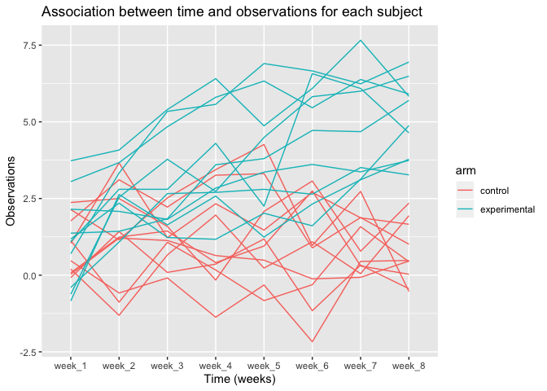
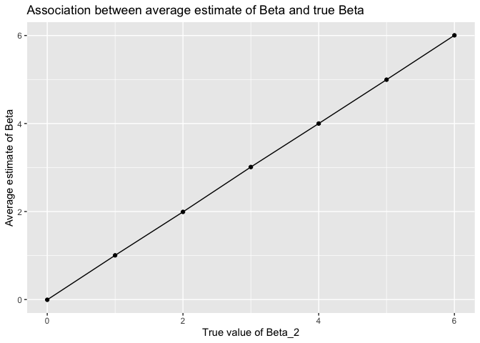
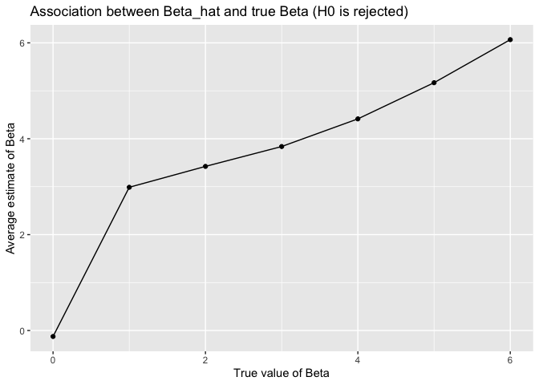

hw5\_jo2570
================
Jai Oberoi
02/11/2019

``` r
set.seed(10)

iris_with_missing = iris %>% 
  janitor::clean_names() %>% 
  map_df(~replace(.x, sample(1:150, 20), NA)) %>%
  mutate(species = as.character(species))
```

Problem 1:

Replacing the missing values:

``` r
replace_values = function(x) {
  if (is.numeric(x) == TRUE) {
    x = x %>% replace_na(round(mean(x, na.rm = TRUE, 2)))
    }
  if (is.character(x) == TRUE) {
    x = x %>% replace_na("virginica")
    }

return(x)
  
}

iris_with_missing = map_df(iris_with_missing, replace_values)
```

Problem 2:

Creating a tidy dataset from the sperate files:

``` r
tidy_df = list.files(path = "./data", full.names = TRUE) %>% 
  map(read.csv) %>% 
  reduce(rbind) %>% 
  mutate(
    subject_id = c(1:20), 
    arm = ifelse(subject_id == c(1:10), "control", "experimental")
  ) %>% 
  select(subject_id, arm, everything())
```

Creating a spaghetti plot showing observations on each subject over
time:

``` r
plot1 = tidy_df %>% 
  pivot_longer(week_1:week_8,
    names_to = "week",
    values_to = "obs") %>% 
  ggplot(aes(x = week, y = obs, color = arm, group = subject_id)) + geom_line()

plot1
```

<!-- -->

Plot 1 shows the observations of each particpant over time in weeks
(weeks each datapoint for each participant was collected). The
participants are grouped into experimental and control. The plot shows
us that observations for the experimental group increase with time,
while observations for the control group are more consistant, on
average.

Problem 3:

Setting simulation design elements:

``` r
set.seed(1)
sim_regression = function(n = 30, b0 = 2, b1 = 0) {
  sim_data = tibble(
    x = rnorm(n, mean = 0, sd = 1),
    y = b0 + b1*x + rnorm(n, 0, sqrt(50))
    )
  ls_fit = lm(y ~ x, data = sim_data) %>%
  broom::tidy()
  tibble( 
  b1_hat = ls_fit[[2,2]],
  p_value = ls_fit[[2,5]]
    )
}
```

Setting beta1 = 0 and generating 10000 datasets from the model:

``` r
sim_results = rerun(10000, sim_regression(b1 = 0)) %>% 
  bind_rows()

sim_results
```

    ## # A tibble: 10,000 x 2
    ##      b1_hat p_value
    ##       <dbl>   <dbl>
    ##  1  0.296     0.798
    ##  2  0.00648   0.996
    ##  3 -2.16      0.155
    ##  4 -0.454     0.718
    ##  5 -0.514     0.730
    ##  6  1.71      0.243
    ##  7 -1.18      0.322
    ##  8  1.09      0.366
    ##  9  0.806     0.377
    ## 10  2.35      0.131
    ## # … with 9,990 more rows

Repeating the step above for beta1 = 1, 2, 3, 4, 5, 6:

``` r
sim_results_2 = 
  tibble(b1_2 = c(1,2,3,4,5,6)) %>% 
  mutate(
    output_lists = map(.x = b1_2, ~rerun(10000, sim_regression(b1 = .x))),
    estimate_dfs = map(output_lists, bind_rows)) %>% 
  select(-output_lists) %>% 
  unnest(estimate_dfs)

sim_results_2
```

    ## # A tibble: 60,000 x 3
    ##     b1_2  b1_hat p_value
    ##    <dbl>   <dbl>   <dbl>
    ##  1     1  3.03    0.0247
    ##  2     1  1.39    0.295 
    ##  3     1  1.93    0.103 
    ##  4     1  0.0151  0.990 
    ##  5     1  0.111   0.944 
    ##  6     1 -1.24    0.366 
    ##  7     1  1.02    0.301 
    ##  8     1  1.82    0.223 
    ##  9     1  2.35    0.0765
    ## 10     1  2.46    0.0966
    ## # … with 59,990 more rows

``` r
sim_results_2 %>% 
   mutate(
    p_value = as.numeric(case_when(
      p_value <= 0.05 ~ "1",
      p_value > 0.05 ~ "0"))) %>% 
  group_by(b1_2) %>% 
  summarise(prop = mean(p_value)) %>%
  ggplot(aes(x = b1_2, y = prop)) + geom_point() + geom_line() + labs(title = "Association between effect size and power", x = "True value of Beta_2", y = "Power of the test")
```

<!-- -->

We see above that as the true value of beta increases, the proportion of
times the null was rejected increases showing that as effect size
increases the power of the test increases.

Creating a plot showing the association between average estimate of Beta
and true Beta:

``` r
sim_results_2 %>%
  group_by(b1_2) %>% 
  summarise(prop = mean(b1_hat)) %>%
  ggplot(aes(x = b1_2, y = prop)) + geom_point() + geom_line() + labs(title = "Association between average estimate of Beta and true Beta", x = "True value of Beta_2", y = "Average estimate of Beta")
```

<!-- -->

Creating a plot showing the association between average estimate of Beta
and true Beta only for values where the null is rejected:

``` r
sim_results_2 %>%
  filter(p_value <= 0.05) %>% 
  group_by(b1_2) %>% 
  summarise(prop = mean(b1_hat)) %>%
  ggplot(aes(x = b1_2, y = prop)) + geom_point() + geom_line() + labs(title = "Association between Beta_hat and true Beta (H0 is rejected)", x = "True value of Beta_2", y = "Average estimate of Beta")
```

<!-- -->

We see that the average estimates of beta for values where H0 is
rejected are not approximately equal to the true values of beta - the
values start quite different, but get closer (more equal) as the true
value of beta increases.
